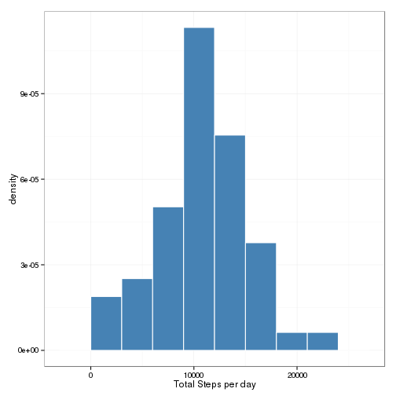
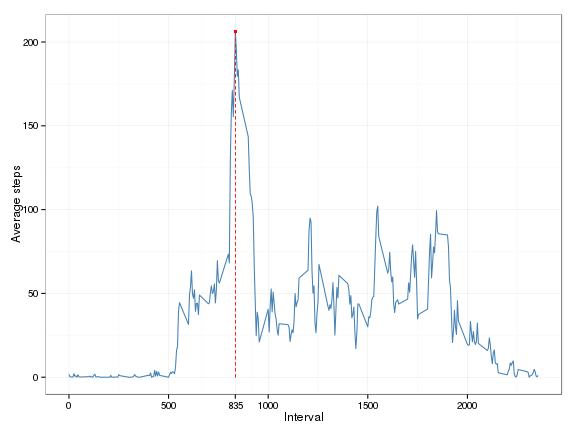
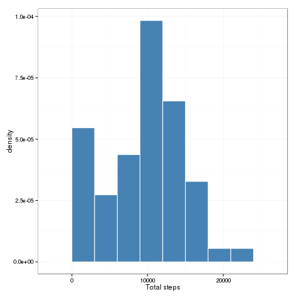
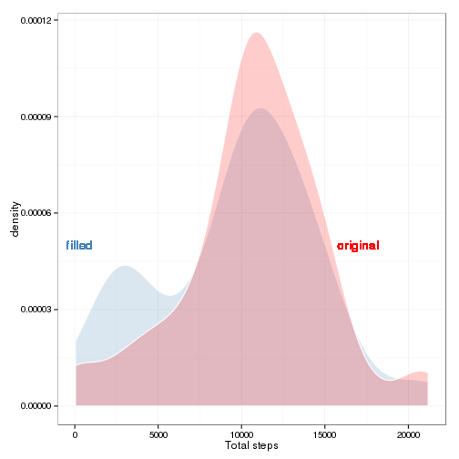
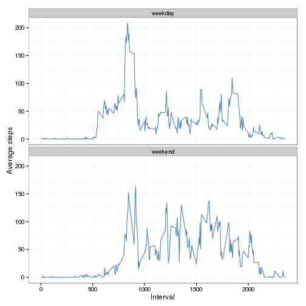

# Reproducible Research: Peer Assessment 1


# Loading and preprocessing the data

For this analysis we will need the `ggplot2` and `dplyr` packages. The first one will be used for plotting and second package will be used to transform the data when necessary.


```r
set.seed(1) ## for reproducibility
library(ggplot2)
library(dplyr)
```

We will load the data only if is not present in the directory.


```r
if (!file.exists("activity.zip")) {
    url <- "https://d396qusza40orc.cloudfront.net/repdata%2Fdata%2Factivity.zip"
    download.file(url, destfile = "activity.zip", method = "curl")
    unzip("activity.zip")
}
```


Once the data downloaded and unzipped, we can read the file using `read.csv` and turn the `date` column into an object of class `Date`.


```r
activity <- read.csv("activity.csv")
activity$date <- as.Date(activity$date)
str(activity)
```

```
## 'data.frame':	17568 obs. of  3 variables:
##  $ steps   : int  NA NA NA NA NA NA NA NA NA NA ...
##  $ date    : Date, format: "2012-10-01" "2012-10-01" ...
##  $ interval: int  0 5 10 15 20 25 30 35 40 45 ...
```

A quick summary of the data shows that we have some missing values.


```r
summary(activity)
```

```
##      steps            date               interval   
##  Min.   :  0.0   Min.   :2012-10-01   Min.   :   0  
##  1st Qu.:  0.0   1st Qu.:2012-10-16   1st Qu.: 589  
##  Median :  0.0   Median :2012-10-31   Median :1178  
##  Mean   : 37.4   Mean   :2012-10-31   Mean   :1178  
##  3rd Qu.: 12.0   3rd Qu.:2012-11-15   3rd Qu.:1766  
##  Max.   :806.0   Max.   :2012-11-30   Max.   :2355  
##  NA's   :2304
```

For the first part of the analysis we will discard missing value.


```r
activitynona <- activity[!is.na(activity$steps), ]
```

# What is the mean total number of steps taken per day?


```r
activityday <- activitynona %>%
    group_by(date) %>%
    summarise(totalsteps = sum(steps, na.rm = TRUE))
```

With the histogram we can see that most of the people take approximatively 10000 per day.


```r
  ggplot(activityday, aes(totalsteps)) +
  geom_histogram(aes(y = ..density..),
  fill = "steelblue",
  colour = "white",
  binwidth = 3000) +
  labs(x = "Total Steps per day") +
  theme_bw()
```

 

There is no difference between the median number of steps per day and average number of steps. This result was predictable since the distribution of the total number of step is quite symetric (see histogram).


```r
activityday %>%
    summarise(meansteps = mean(totalsteps),
	      mediansteps = median(totalsteps))
```

```
## Source: local data frame [1 x 2]
## 
##   meansteps mediansteps
## 1     10766       10765
```

# What is the average daily activity pattern?

We will now analyze the activity pattern by interval.


```r
activity5min <- activitynona %>%
    group_by(interval) %>%
	summarise(avgsteps = mean(steps))
```

The maximum number of steps was taken at interval :


```r
(intervalmax <- activity5min$interval[which.max(activity5min$avgsteps)])
```

```
## [1] 835
```

And the maximum number of steps is 


```r
(stepmax <- max(activity5min$avgsteps))
```

```
## [1] 206.2
```

The graph below shows the activity pattern by interval with a peak around the interval 835 


```r
  ggplot(activity5min, aes(interval, avgsteps)) +
      geom_line(colour = "steelblue") +
      geom_point(x = intervalmax,
                 y = stepmax,
                 colour = "red", 
                 shape = 19, size = 0.8) +
      geom_segment(x = intervalmax, y = 0,
                   xend = intervalmax,
                   yend = stepmax,
                   linetype = "dashed", colour = "red",
                   size = 0.07, alpha = 0.1) +
     scale_x_continuous(breaks = c(0, 500, 
                intervalmax, 1000, 1500, 2000)) +
  labs(x = "Interval", y = "Average steps") +
  theme_bw()
```

 

# Imputing missing values

We have a lot of missing rows in the datasets 


```r
sum(!complete.cases(activity))
```

```
## [1] 2304
```

All the missing data are in fact in the `steps` variable 


```r
sum(is.na(activity$steps))
```

```
## [1] 2304
```

To replace the missing values in the `steps` variable we will replace each missing data by the median data for corresponding the day of the week (Monday, Tuesday, etc.) at the interval considered. For example if the data is missing a monday at the interval 900 we will use the median value (discarding missing value) of all monday at the interval 900.
In this exercise, the median is prefered to the average because it is more robust to outlier.

To easily impute the missing value using the scheme proposed, we will first create an index of weekday-interval and split the data in two parts : missing and non missing data


```r
activity$wdmin <- weekdays(activity$date)
activity$wdmin <- paste0(activity$wdmin, activity$interval)
activitynona <- activity[!is.na(activity$steps), ]
activityna <- activity[is.na(activity$steps), ]
```

The next step is to compute the median per weekday-interval


```r
toimpute <- activity %>%
  group_by(wdmin) %>%
  summarise(steps = median(steps, na.rm = TRUE))
sample_n(toimpute, 5)
```

```
## Source: local data frame [5 x 2]
## 
##              wdmin steps
## 536      Monday635     0
## 750   Saturday2240     0
## 1154    Thursday10     0
## 1829 Wednesday1705     0
## 406     Monday1830    60
```

Now we have the data to impute we can merge it to the original data


```r
activityna$steps <- NULL
activityna <- inner_join(activityna, toimpute)
```

```
## Joining by: "wdmin"
```

```r
activityfilled <- rbind(activityna, activitynona)
activityfilled <- activityfilled %>% arrange(date, interval)
```

With the filled data it is possible to have to total number of steps per day without discarding any data


```r
activitydayfilled <- activityfilled %>%
group_by(date) %>%
summarise(totalsteps = sum(steps))
```

Let's compute the mean and median steps with the filled data


```r
activitydayfilled %>%
summarise(meansteps = mean(totalsteps),
mediansteps = median(totalsteps))
```

```
## Source: local data frame [1 x 2]
## 
##   meansteps mediansteps
## 1      9705       10395
```
The difference between median and mean is more pronounced with the filled data compared to the original data with missing values. 


```r
ggplot(activitydayfilled, aes(totalsteps)) +
  geom_histogram(aes(y = ..density..),
                 fill = "steelblue",
                 colour = "white",
                 binwidth = 3000) +
                   labs(x = "Total steps") +
                   theme_bw()
```

 

The histogram shows a difference at the tail of the distribution and the density plot below highlight this difference between the original data and filled one.
In fact, the graph in blue (the filled data) shows a heavier tail than the graph in red (original data). This difference doesn't affect the median but the mean which is more sensitive to distributions tails differ signifcantly.


```r
ggplot(activitydayfilled, aes(totalsteps)) +
  geom_density(fill = "steelblue",
               colour = "white",
               binwidth = 3000,
               alpha = 0.2) +
                 geom_density(aes(x = totalsteps),
                              fill = "red",
                              colour = "white",
                              binwidth = 3000,
                              alpha = 0.2,
                              data = activityday) +
                                labs(x = "Total steps") +
                                geom_text(x = 275, y = 0.00005,
                                          label = "filled",
                                          colour = "steelblue",
                                          family = "serif") +
                                            geom_text(x = 17000, y = 0.00005,
                                                      label = "original",
                                                      colour = "red",
                                                      family = "serif") +
                                                        theme_bw()
```

 

# Are there differences in activity patterns between weekdays and weekends?

Let's create a function to separate the date in weekend and weekday.


```r
weekend <- function(date) {
    ifelse(is.element(weekdays(date), c("Saturday",  "Sunday")),
	   "weekend", "weekday")
}
```

Now we can apply this function to the filled data


```r
activityfilled$weekday <- weekend(activityfilled$date)
table(activityfilled$weekday)
```

```
## 
## weekday weekend 
##   12960    4608
```

With this new variable we can check if there is a difference of activity if we are in week-end or not.


```r
activitywkd <- activityfilled %>%
  group_by(weekday, interval) %>%
    summarise(wkavgsteps = mean(steps))
```

The graph below highlights a different behavior between activity done in weekday and weekend. There is slightly more activity in the week end and in particular between interval 1000 and 1500.


```r
ggplot(activitywkd, aes(interval, wkavgsteps)) +
geom_line(colour = "steelblue") +
facet_wrap( ~ weekday, ncol = 1) +
labs(x = "Interval", y = "Average steps") +
theme_bw()
```

 


Here are the information of the R session for this analysis 


```r
sessionInfo()
```

```
## R version 3.1.1 Patched (2014-09-07 r66542)
## Platform: x86_64-unknown-linux-gnu (64-bit)
## 
## locale:
##  [1] LC_CTYPE=en_US.utf8       LC_NUMERIC=C             
##  [3] LC_TIME=en_US.utf8        LC_COLLATE=en_US.utf8    
##  [5] LC_MONETARY=en_US.utf8    LC_MESSAGES=en_US.utf8   
##  [7] LC_PAPER=en_US.utf8       LC_NAME=C                
##  [9] LC_ADDRESS=C              LC_TELEPHONE=C           
## [11] LC_MEASUREMENT=en_US.utf8 LC_IDENTIFICATION=C      
## 
## attached base packages:
## [1] stats     graphics  grDevices utils     datasets  methods   base     
## 
## other attached packages:
## [1] dplyr_0.2.0.9000 ggplot2_1.0.0    knitr_1.6       
## 
## loaded via a namespace (and not attached):
##  [1] assertthat_0.1.0.99 colorspace_1.2-4    DBI_0.3.0.9000     
##  [4] digest_0.6.4        evaluate_0.5.5      formatR_1.0        
##  [7] grid_3.1.1          gtable_0.1.2        labeling_0.3       
## [10] magrittr_1.0.1      markdown_0.7.4      MASS_7.3-34        
## [13] mime_0.1.2          munsell_0.4.2       parallel_3.1.1     
## [16] plyr_1.8.1          proto_0.3-10        Rcpp_0.11.2        
## [19] reshape2_1.4        scales_0.2.4        stringr_0.6.2      
## [22] tools_3.1.1
```
